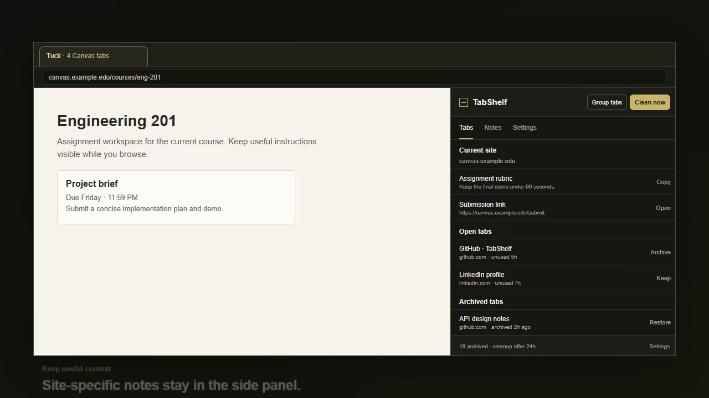

# TabShelf

TabShelf is a local-first Chrome side-panel extension that makes tab cleanup safe, reversible, and fast. It keeps useful links and snippets at hand without turning the browser into another dashboard.



[Watch the 17-second product demo](assets/demo/tabshelf-demo.webm)

## Highlights

- **Safe cleanup.** Inactive tabs are discarded only after active, pinned, audible, incognito, protected-tab, protected-domain, URL, and inactivity checks.
- **Archive before close.** Every tab is saved to `chrome.storage.local` and that write is confirmed before Chrome is asked to close it.
- **Quick recovery.** Search, restore, or delete archived tabs from the side panel.
- **Useful saved items.** Keep domain-aware links and snippets. Correct values inline and choose Copy, Open, or Edit as the primary action.
- **Tuck tab grouping.** Select **Group tabs** to collect matching ungrouped site tabs into native Chrome tab groups named `Tuck`. It never closes, merges, or changes existing groups.
- **Local and customizable.** Use accessible themes, custom theme validation, protected domains, and JSON export/import. No account required.

## Privacy

TabShelf has no account, backend, analytics, cloud sync, page-content scraping, cookies, tokens, or saved form values. Your archive, notes, preferences, and exports stay on your device.

## Install locally

1. Download or clone this repository and run `pnpm install`.
2. Run `pnpm build`.
3. Open `chrome://extensions`, enable **Developer mode**, then choose **Load unpacked**.
4. Select the generated `dist` directory.
5. Pin TabShelf if desired, then open its side panel from the extension action.

TabShelf targets Chrome 116 or later.

## How tab safety works

For every archive-and-close operation, TabShelf validates the tab again immediately before acting. It builds the archive record, writes it locally, confirms the saved record, and only then calls `chrome.tabs.remove`. If saving fails, the tab is not closed and the side panel reports the error.

Protected tabs, protected domains, active tabs, pinned tabs (when enabled), audible tabs (when enabled), internal URLs, malformed URLs, and excluded incognito tabs are never eligible for automatic cleanup.

## Permissions

- `tabs` reads tab metadata needed for inactivity, safety checks, restoration, and local archiving.
- `storage` keeps archives, notes, themes, and settings on this device.
- `alarms` schedules quiet cleanup checks.
- `sidePanel` opens the persistent browser side panel.
- `contextMenus` lets users deliberately save selected text as a note.
- `tabGroups` creates and labels native Chrome tab groups only after the user selects **Group tabs**.

## Development

Use Node 22+ and pnpm:

```bash
pnpm install
pnpm check
pnpm test:e2e
pnpm build
```

`pnpm check` runs linting, formatting verification, unit tests, and the production build. `pnpm test:e2e` runs the extension integration test. To regenerate the repository demo video, run `pnpm demo:record`.

## Repository assets

- [Launch-ready LinkedIn post](docs/LINKEDIN_LAUNCH_POST.md)
- [Product demo video](assets/demo/tabshelf-demo.webm)
